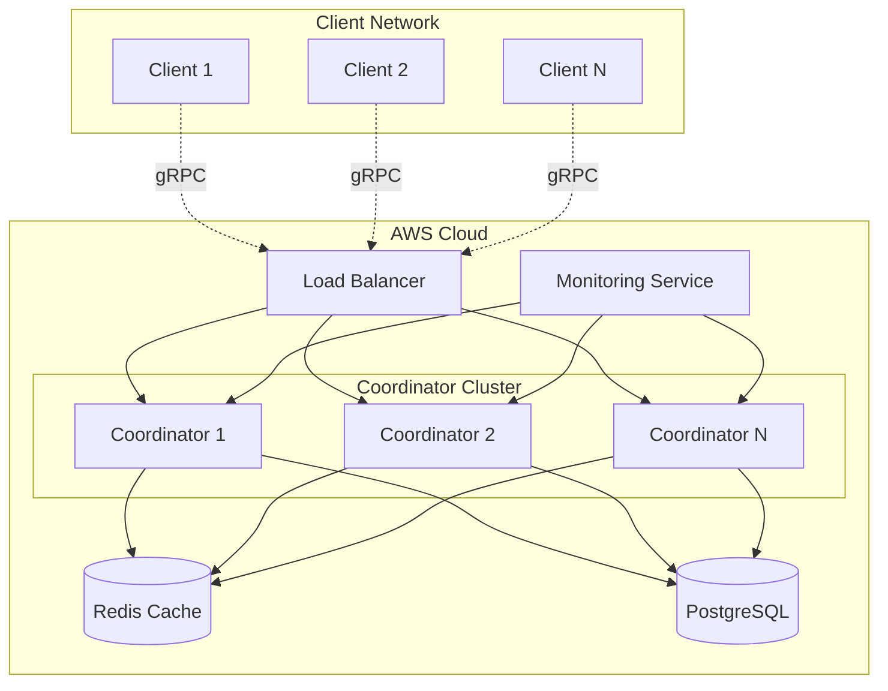

# Design Document

## Overview

The federated learning system implements a distributed machine learning framework that enables privacy-preserving image classification across multiple clients. The system uses a coordinator-client architecture where clients train models locally on their private data and only share model updates (not raw data) with a central coordinator. The coordinator aggregates these updates using the FedAvg algorithm and distributes the improved global model back to clients.

Key design principles:
- **Privacy-first**: Raw data never leaves client devices
- **Scalable**: Support for 50+ concurrent clients with horizontal scaling
- **Efficient**: Optimized communication protocols and model compression
- **Production-ready**: Containerized deployment with monitoring and fault tolerance

## Architecture

### High-Level Architecture



### Service Architecture

The system consists of three main services:

1. **Coordinator Service**: Manages federated learning rounds, aggregates model updates, and maintains global model state
2. **Client Service**: Handles local training, differential privacy, and communication with coordinator
3. **Aggregation Service**: Implements FedAvg algorithm and model compression techniques

## Components and Interfaces

### Coordinator Service

**Responsibilities:**
- Manage federated learning rounds and client registration
- Coordinate model distribution and update collection
- Implement FedAvg aggregation algorithm
- Handle client failures and dynamic scaling
- Maintain training metrics and convergence tracking

**Key Interfaces:**
```python
class CoordinatorService:
    def register_client(self, client_id: str, capabilities: ClientCapabilities) -> RegistrationResponse
    def get_global_model(self, client_id: str, round_number: int) -> ModelResponse
    def submit_model_update(self, client_id: str, model_update: ModelUpdate) -> AckResponse
    def start_training_round(self, round_config: RoundConfig) -> RoundResponse
    def get_training_status(self) -> TrainingStatus
```

**gRPC Service Definition:**
```protobuf
service FederatedLearning {
    rpc RegisterClient(ClientRegistration) returns (RegistrationResponse);
    rpc GetGlobalModel(ModelRequest) returns (ModelResponse);
    rpc SubmitUpdate(ModelUpdate) returns (UpdateAck);
    rpc GetTrainingStatus(StatusRequest) returns (TrainingStatus);
}
```

### Client Service

**Responsibilities:**
- Load and preprocess local training data
- Perform local model training with PyTorch
- Apply differential privacy noise to model updates
- Compress and transmit model updates to coordinator
- Handle network failures and retry logic

**Key Interfaces:**
```python
class ClientService:
    def initialize_local_model(self, global_model: torch.nn.Module) -> None
    def train_local_model(self, epochs: int, batch_size: int) -> TrainingMetrics
    def apply_differential_privacy(self, model_update: ModelUpdate, epsilon: float) -> ModelUpdate
    def compress_model_update(self, model_update: ModelUpdate) -> CompressedUpdate
    def sync_with_coordinator(self) -> SyncResult
```

### Aggregation Service

**Responsibilities:**
- Implement FedAvg weighted averaging algorithm
- Handle model compression and decompression
- Validate model updates for consistency
- Optimize aggregation performance for large client sets

**Key Interfaces:**
```python
class AggregationService:
    def aggregate_updates(self, updates: List[ModelUpdate], weights: List[float]) -> GlobalModel
    def validate_update(self, update: ModelUpdate) -> ValidationResult
    def compress_global_model(self, model: GlobalModel) -> CompressedModel
    def calculate_convergence_metrics(self, old_model: GlobalModel, new_model: GlobalModel) -> ConvergenceMetrics
```

## Data Models

### Core Data Structures

```python
@dataclass
class ModelUpdate:
    client_id: str
    round_number: int
    model_weights: Dict[str, torch.Tensor]
    num_samples: int
    training_loss: float
    privacy_budget_used: float
    compression_ratio: float
    timestamp: datetime

@dataclass
class GlobalModel:
    round_number: int
    model_weights: Dict[str, torch.Tensor]
    accuracy_metrics: Dict[str, float]
    participating_clients: List[str]
    convergence_score: float
    created_at: datetime

@dataclass
class ClientCapabilities:
    compute_power: ComputePowerLevel
    network_bandwidth: int  # Mbps
    available_samples: int
    supported_models: List[str]
    privacy_requirements: PrivacyConfig

@dataclass
class PrivacyConfig:
    epsilon: float  # Differential privacy parameter
    delta: float    # Differential privacy parameter
    max_grad_norm: float  # Gradient clipping threshold
    noise_multiplier: float
```

### Database Schema

**Training Rounds Table:**
```sql
CREATE TABLE training_rounds (
    id SERIAL PRIMARY KEY,
    round_number INTEGER NOT NULL,
    global_model_path VARCHAR(255),
    participating_clients INTEGER,
    accuracy DECIMAL(5,4),
    convergence_score DECIMAL(8,6),
    started_at TIMESTAMP,
    completed_at TIMESTAMP
);
```

**Client Updates Table:**
```sql
CREATE TABLE client_updates (
    id SERIAL PRIMARY KEY,
    client_id VARCHAR(100) NOT NULL,
    round_number INTEGER NOT NULL,
    model_update_path VARCHAR(255),
    num_samples INTEGER,
    training_loss DECIMAL(10,8),
    privacy_budget_used DECIMAL(6,4),
    submitted_at TIMESTAMP,
    FOREIGN KEY (round_number) REFERENCES training_rounds(round_number)
);
```

## Error Handling

### Client-Side Error Handling

1. **Network Failures:**
   - Implement exponential backoff retry mechanism
   - Cache model updates locally during network outages
   - Resume training from last successful checkpoint

2. **Training Failures:**
   - Validate data integrity before training
   - Handle CUDA out-of-memory errors gracefully
   - Implement model checkpoint recovery

3. **Privacy Budget Exhaustion:**
   - Monitor privacy budget consumption
   - Gracefully degrade participation when budget is low
   - Provide clear feedback to client administrators

### Coordinator-Side Error Handling

1. **Client Failures:**
   - Detect client timeouts and remove from current round
   - Maintain minimum client threshold for valid aggregation
   - Handle partial model updates gracefully

2. **Aggregation Failures:**
   - Validate model update compatibility before aggregation
   - Handle numerical instabilities in FedAvg algorithm
   - Implement rollback mechanism for failed rounds

3. **Scaling Issues:**
   - Monitor resource utilization and trigger auto-scaling
   - Implement circuit breakers for overloaded services
   - Graceful degradation under high load

### Error Recovery Strategies

```python
class ErrorRecoveryManager:
    def handle_client_timeout(self, client_id: str, round_number: int) -> RecoveryAction
    def handle_aggregation_failure(self, round_number: int, error: Exception) -> RecoveryAction
    def handle_model_divergence(self, convergence_metrics: ConvergenceMetrics) -> RecoveryAction
    def trigger_emergency_rollback(self, target_round: int) -> RollbackResult
```

## Testing Strategy

### Unit Testing

1. **Model Training Components:**
   - Test local training convergence on synthetic datasets
   - Validate differential privacy noise injection
   - Test model compression/decompression accuracy

2. **Aggregation Logic:**
   - Test FedAvg algorithm with known inputs and expected outputs
   - Validate weighted averaging with different client contributions
   - Test convergence detection algorithms

3. **Communication Protocols:**
   - Mock gRPC services for client-coordinator communication
   - Test serialization/deserialization of model updates
   - Validate retry and timeout mechanisms

### Integration Testing

1. **End-to-End Training:**
   - Simulate federated training with multiple mock clients
   - Test complete training rounds from initialization to convergence
   - Validate privacy preservation throughout the process

2. **Scalability Testing:**
   - Test system behavior with increasing client counts (10, 25, 50+ clients)
   - Measure latency and throughput under load
   - Test auto-scaling triggers and behavior

3. **Fault Tolerance Testing:**
   - Simulate client failures during training rounds
   - Test coordinator failover and recovery
   - Validate data consistency after failures

### Performance Testing

1. **Latency Benchmarks:**
   - Measure round completion time vs. client count
   - Test model update transmission time
   - Benchmark aggregation algorithm performance

2. **Accuracy Validation:**
   - Compare federated learning accuracy to centralized baseline
   - Test convergence speed with different privacy parameters
   - Validate 91% accuracy requirement on MNIST dataset

3. **Resource Utilization:**
   - Monitor CPU, memory, and network usage
   - Test Docker container resource limits
   - Validate AWS EC2 scaling efficiency

### Security Testing

1. **Privacy Validation:**
   - Test differential privacy guarantees with various epsilon values
   - Validate that raw data is never transmitted
   - Test privacy budget tracking accuracy

2. **Communication Security:**
   - Test gRPC TLS encryption
   - Validate authentication and authorization mechanisms
   - Test against model inversion attacks

## Deployment Architecture

### Containerization Strategy

```dockerfile
# Coordinator Service
FROM python:3.9-slim
COPY requirements.txt .
RUN pip install -r requirements.txt
COPY src/ /app/src/
WORKDIR /app
EXPOSE 8080 50051
CMD ["python", "-m", "src.coordinator.main"]
```

### AWS EC2 Deployment

1. **Auto Scaling Group Configuration:**
   - Min instances: 2, Max instances: 10
   - Scale up trigger: CPU > 70% for 5 minutes
   - Scale down trigger: CPU < 30% for 10 minutes

2. **Load Balancer Setup:**
   - Application Load Balancer for HTTP traffic (Flask APIs)
   - Network Load Balancer for gRPC traffic
   - Health checks on coordinator service endpoints

3. **Monitoring and Logging:**
   - CloudWatch for system metrics and logs
   - Custom metrics for federated learning progress
   - Alerts for client connection failures and training stalls